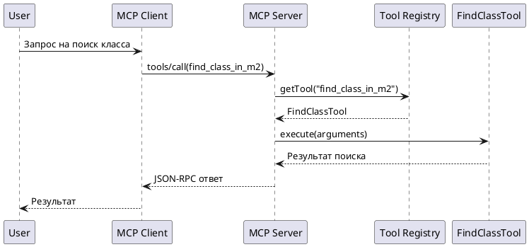

# TASK-027: ApplicationEventPublisher для проекта

## Информация о задаче

| Поле | Значение |
|------|----------|
| **Модуль:** | `common` |
| **ID:** | 027 |
| **Файл:** | `TASK-027_common_application_event_publisher.md` |
| **Приоритет:** | Низкий |
| **Связь:** | [docs/global-plans.md](../../docs/global-plans.md) |

---

## Описание

Требуется рассмотреть применение ApplicationEventPublisher для проекта и реализовать публикацию событий для различных событий внутри приложения.

**Контекст:**
- ApplicationEventPublisher — стандартный механизм Spring для событий
- Позволяет реализовать слабую связанность компонентов
- Может использоваться для логирования, аудита, метрик
- События будут использоваться для построения Sequence Diagram на PlantUML

**Цель:**
- Изучить применимость ApplicationEventPublisher
- Реализовать события для JSON-RPC запросов и других событий приложения
- Создать слушателей для логирования и метрик
- Реализовать генерацию Sequence Diagram на PlantUML на основе событий

## Критерии приёмки (Acceptance Criteria)

- [ ] Изучена документация ApplicationEventPublisher
- [ ] Созданы события для JSON-RPC запросов
- [ ] Созданы события для других событий приложения (RAG, MCP-клиенты)
- [ ] Реализованы слушатели событий
- [ ] Реализован сбор событий для построения Sequence Diagram
- [ ] Реализована генерация Sequence Diagram на PlantUML
- [ ] Реализована генерация SVG из PlantUML
- [ ] Написаны тесты на события
- [ ] Подготовлена документация

## TDD Цикл

### 🔴 RED — Тесты

- [ ] Написан тест на публикацию события запроса
- [ ] Написан тест на обработку события слушателем
- [ ] Тесты падают (события ещё не реализованы)

### 🟢 GREEN — Реализация

- [ ] Созданы классы событий (McpRequestEvent, McpResponseEvent)
- [ ] Реализована публикация событий в JsonRpcHandler
- [ ] Созданы слушатели для логирования
- [ ] Реализован EventListener для сбора событий
- [ ] Реализована генерация Sequence Diagram на PlantUML
- [ ] Реализована генерация SVG из PlantUML
- [ ] Все тесты проходят

### 🔵 REFACTOR — Рефакторинг

- [ ] Код рефакторен
- [ ] Устранено дублирование
- [ ] Сборка успешна: `mvn clean package`

## Работа с существующим кодом

- [ ] Изучена текущая архитектура MCP-сервера
- [ ] Проверена возможность интеграции с Logbook

## Чек-лист завершения

- [ ] Все тесты зелёные
- [ ] Сборка успешна
- [ ] Sequence Diagram сохранены в `docs/architecture/sequence/` в формате .svg
- [ ] Код соответствует стандартам проекта
- [ ] Изменения закоммичены

## Статус

| Поле | Значение |
|------|----------|
| **Модуль:** | `common` |
| Дата создания: | 2026-03-26 |
| Дата начала: | |
| Дата завершения: | |
| Статус: | 📋 |

## Заметки

### События для реализации

**JSON-RPC события:**
- **McpRequestReceivedEvent** — получен входящий запрос
- **McpRequestProcessedEvent** — запрос обработан
- **McpErrorEvent** — ошибка обработки запроса

**RAG события:**
- **RagQueryEvent** — выполнен запрос к RAG
- **RagEmbeddingEvent** — выполнена векторизация запроса
- **RagRetrievalEvent** — выполнен поиск в векторной базе

**MCP-клиент события:**
- **McpClientConnectedEvent** — клиент подключился к серверу
- **McpClientToolCalledEvent** — вызван инструмент MCP-сервера

### Слушатели

- Логирование событий
- Сбор метрик производительности
- Аудит действий
- **Сбор событий для Sequence Diagram**
- **Генерация PlantUML из собранных событий**

### Пример генерации Sequence Diagram



### Архитектура решения

```
Приложение → ApplicationEventPublisher → EventListener → EventStore → PlantUML Generator → .puml → SVG Generator → .svg файлы
```

### Пример генерации SVG из PlantUML

```java
import net.sourceforge.plantuml.FileFormat;
import net.sourceforge.plantuml.FileFormatOption;
import net.sourceforge.plantuml.SourceStringReader;

import java.io.ByteArrayOutputStream;
import java.io.File;
import java.io.FileOutputStream;

String plantUmlSource = loadSequenceDiagram(); // Получение PlantUML из событий

SourceStringReader reader = new SourceStringReader(plantUmlSource);
ByteArrayOutputStream os = new ByteArrayOutputStream();

// Генерация SVG
reader.outputImage(os, new FileFormatOption(FileFormat.SVG));

// Сохранение в файл
File svgFile = new File("docs/architecture/sequence/sequence-diagram.svg");
try (FileOutputStream fos = new FileOutputStream(svgFile)) {
    fos.write(os.toByteArray());
}
```

### Ссылки

- [Spring Events](https://docs.spring.io/spring-framework/docs/current/reference/html/core.html#context-functionality-events)
- [PlantUML Sequence Diagram](https://plantuml.com/ru/sequence-diagram)
- [Глобальный план](../../docs/global-plans.md)
- [TASK-029 (Structurizr + PlantUML)](./TASK-029_common_structurizr_plantuml_research.md)
